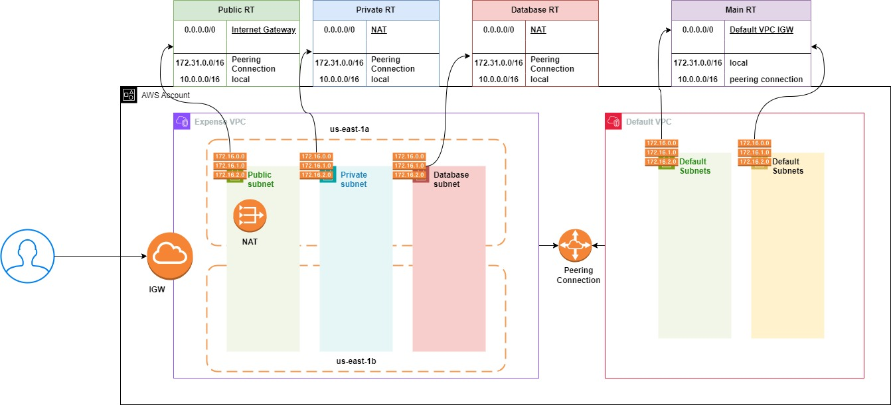

# custom AWS VPC Module

This module is developed for joindevops.com. we are creating following resources. This module creates resources in first 2 AZ for HA.
* VPC
* Internet Gateway
* Internet and vpc attachment
* 2 public subnets.
* 2 private subnets.
* 2 database subnets.
* EIP
* NAT Gateway
* public Route table
* private Route table
* Database Route table
* Route table associations
* Routes in all tables
* peering if required for user
* Routes of peering in requestor and acceptor vpc.
* Database subnet group

### Inputs
* project_name (Required): User should mention their project name. type is string.
* environment (Optional): default value is dev. type is string
* common_tags (Required): User should their tags related to their project. type is map.
* vpc_cidr (Optional): Default value is 10.0.0.0/16. type is string.
* enable_dns_hostnames (Optional): Default value is true. type is bool
* vpc_tags (Optional): Default value is empty. type is map.
* igw_tags (Optional): Default value is empty. type is map.
* public_subnet_cidr (Required): User has to provide 2 valid subnet CIDR.
* public_subnet_cidr_tags (Optional): Default value is empty. type is map.
* private_subnet_cidr (Required): User has to provide 2 valid subnet CIDR.
* private_subnet_cidr_tags (Optional): Default value is empty. type is map.
* database_subnet_cidr (Required): User has to provide 2 valid subnet CIDR.
* database_subnet_cidr_tags (Optional): Default value is empty. type is map.
* is_peering_required (Optional): Default value is false. Typeis bool.
* acceptor_vpc_id (Optional): Default value is empty, default vpc ID would be taken. Type is string.
* vpc_peering_tags (Optional): Default value is empty. type is map.

### Outputs
* vpc_id: VPC ID
* public_subnet_ids: A list of 2 public subnet IDs created.
* private_subnet_ids: A list of 2 private subnet IDs created.
* database_subnet_ids: A list of 2 database subnet IDs created.
* database_subnet_group_id: A database subnet group ID created.